# Claude Code提问艺术完全指南 - AI编程协作的最佳实践 (2025版)

> 🎯 **掌握Claude Code的精髓，让AI成为你最强的编程伙伴！**  
> ⚡ **2025年全新升级版** - 涵盖斜杠命令、Memory管理、Agent代理、IDE集成、GitHub Actions、MCP协议等革命性功能

**从提问新手到AI协作专家的完整成长路径** 🚀✨

## 📋 目录导航

### 🚀 新手必读
- [小白5分钟快速入门](#小白5分钟快速入门) ⭐ **先看这里**
- [学习路径图](#学习路径图)
- [真实对话示例](#真实对话示例)

### 📚 核心方法（基础）
1. [基础提问原则](#基础提问原则) 🔰
2. [需求记录最佳实践](#需求记录最佳实践) 🔰
3. [提问技巧详解](#提问技巧详解) 📈

### 🎯 进阶内容
4. [提问顺序和流程](#提问顺序和流程) 📈
5. [上下文管理策略](#上下文管理策略) 🔥
6. [项目开发完整流程](#项目开发完整流程) 🔥

### 🛠️ 2025年新功能
7. [Claude Code高级功能](#claude-code高级功能) 🌟 **从"会问"到"巧问"**
8. [IDE集成与GitHub Actions](#ide集成与github-actions) ⚡ **从终端到IDE的协作升级**
9. [MCP协议与扩展能力](#mcp协议与扩展能力) 🔌 **连接真实世界的数据和工具**
10. [实用模板和示例](#实用模板和示例) 💎 **覆盖90%开发场景的实战模板**
11. [实战练习](#实战练习) 💪 **从新手到专家的完整练习体系**

---

## 🚀 小白5分钟快速入门

### 💡 核心思想：让AI做你的专业顾问

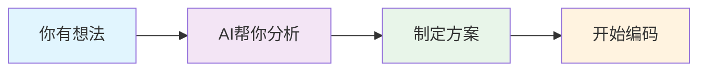

### 🎯 三种基本交流方式

#### 方式1️⃣：直接提问（适合简单需求）
```
❌ 错误：帮我写个网站
✅ 正确：我想做个个人博客，用React和Node.js，需要文章发布和评论功能
```

#### 方式2️⃣：让AI引导（适合复杂项目）
```
✅ 万能句式：
"我有个项目想法但还不够清晰，请担任产品经理的角色，通过专业提问帮我完善需求"
```

#### 方式3️⃣：问题解决（适合Bug修复）
```
✅ 标准格式：
"遇到问题：[现象描述]
错误信息：[复制粘贴错误]
请帮我分析原因和解决方案"
```

### ⚡ 5分钟上手步骤

1. **第一步**：复制下面的万能模板
2. **第二步**：填写你的具体信息
3. **第三步**：发送给Claude Code
4. **第四步**：回答AI的问题
5. **第五步**：开始编码！

#### 🎪 万能启动模板
```
我想开发一个[项目类型]，主要解决[什么问题]。
目标用户：[谁会用这个]
核心功能：[最重要的功能]
请问我一些问题来完善这个想法！
```

### 📊 决策树：我该怎么问？

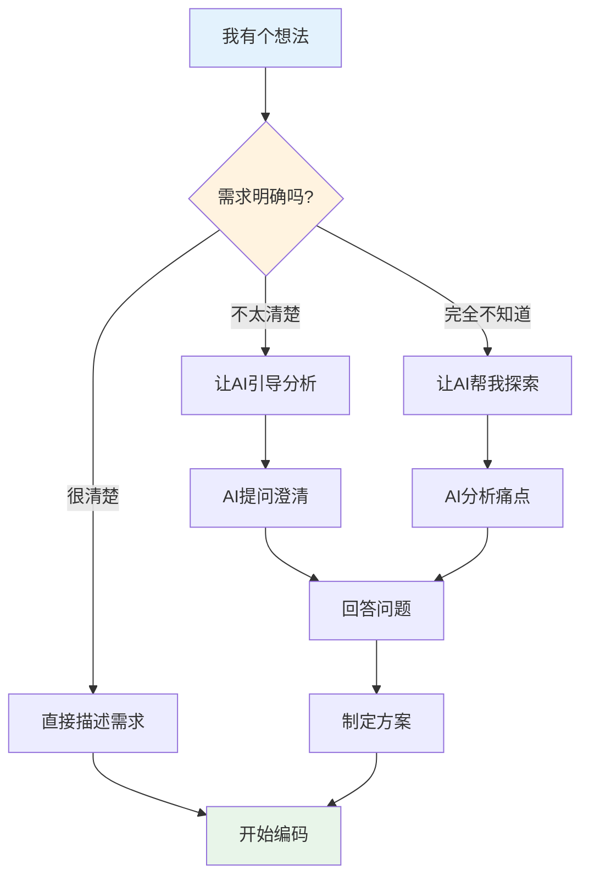

### 🎁 立即试试：3个练习

#### 练习1：简单项目
> "我想做个待办事项应用，帮助我管理日常任务，请问需要了解什么细节？"

#### 练习2：学习项目  
> "我想学React并做个实际项目练手，请推荐项目并设计学习路径"

#### 练习3：问题解决
> "我的网站加载很慢，用的是Vue+Express，请帮我诊断和优化"

---

## 📈 学习路径图

### 🎯 推荐学习顺序

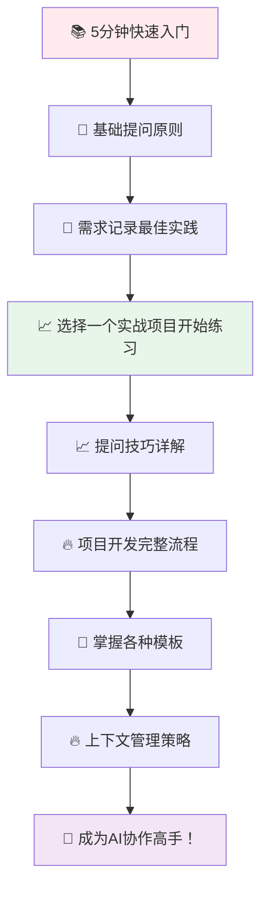

### 📊 技能等级对照

| 等级 | 标志 | 能力描述 | 推荐章节 |
|------|------|----------|----------|
| 🔰 **新手** | 刚开始使用AI编程 | 能提出基本问题，获得简单帮助 | 1-3章 |
| 📈 **进阶** | 开始独立项目开发 | 能让AI协助完整项目开发 | 4-6章 |
| 🔥 **熟练** | 复杂项目游刃有余 | 能处理复杂需求和长期项目 | 7章+实战 |
| 💎 **专家** | AI协作如臂使指 | 能构建完整的协作工作流 | 全部+创新 |

---

## 🎭 真实对话示例

### 💼 案例1：从零开始的Web项目

#### 👤 用户初始提问
> "我想做个电商网站，请问我一些问题来完善需求"

#### 🤖 AI的专业回应
> "好的！我来了解一下你的电商项目需求：
> 
> **基本情况：**
> 1. 目标用户是谁？（个人消费者/企业客户/特定群体）
> 2. 主要销售什么产品？（实物商品/数字产品/服务）
> 3. 预计规模如何？（商品数量、用户量级）
> 
> **功能需求：**
> 1. 需要哪些核心功能？（商品展示、购物车、支付、用户管理等）
> 2. 需要后台管理系统吗？
> 3. 是否需要移动端适配？
> 
> **技术约束：**
> 1. 有技术栈偏好吗？
> 2. 预算和时间限制？
> 3. 是否需要第三方集成（支付、物流等）？"

#### 👤 用户回答
> "目标用户是年轻人，主要卖潮流服装，预计500个商品，需要完整的购物功能和手机适配，我比较熟悉React，预算有限希望用开源方案"

#### 🤖 AI制定方案
> "基于你的需求，我推荐以下技术方案：
> 
> **技术栈：**
> - 前端：React + Next.js（SEO友好）
> - 后端：Node.js + Express
> - 数据库：MongoDB（文档型，适合商品数据）
> - 支付：Stripe（简单易用）
> - 部署：Vercel + MongoDB Atlas（免费额度）
> 
> **开发计划：**
> 第1周：项目搭建 + 商品展示
> 第2周：用户系统 + 购物车
> 第3周：订单系统 + 支付集成
> 第4周：后台管理 + 测试部署
> 
> 这个方案符合你的需求吗？需要调整哪些地方？"

### 🔧 案例2：Bug修复对话

#### 👤 用户问题
> "我的React应用登录后跳转有问题，控制台报错：Cannot read property 'push' of undefined"

#### 🤖 AI诊断
> "这个错误通常是路由跳转的问题。让我帮你诊断：
> 
> **请提供以下信息：**
> 1. 使用的路由库？（React Router v5/v6？）
> 2. 登录跳转的代码片段
> 3. 完整的错误堆栈信息
> 
> **常见原因：**
> - history对象未正确获取
> - useHistory/useNavigate钩子使用错误
> - 组件层级问题"

#### 👤 用户补充
> "用的React Router v6，代码是这样的：
> ```javascript
> const handleLogin = () => {
>   // 验证成功后
>   history.push('/dashboard');
> };
> ```"

#### 🤖 AI解决方案
> "找到问题了！React Router v6中已经移除了`history.push`，需要用`useNavigate`：
> 
> **修复方案：**
> ```javascript
> import { useNavigate } from 'react-router-dom';
> 
> function LoginComponent() {
>   const navigate = useNavigate();
>   
>   const handleLogin = () => {
>     // 验证成功后
>     navigate('/dashboard');
>   };
> }
> ```
> 
> **关键变化：**
> - `useHistory()` → `useNavigate()`
> - `history.push()` → `navigate()`
> - `history.replace()` → `navigate('/', { replace: true })`"

### 🚀 案例3：学习项目规划

#### 👤 用户需求
> "我想学Vue3，请设计一个实践项目和学习路径"

#### 🤖 AI规划
> "为你设计一个渐进式Vue3学习项目：
> 
> **推荐项目：个人任务管理应用**
> 
> **学习路径：**
> 
> ```mermaid
> graph LR
>     A[基础语法] --> B[组件开发]
>     B --> C[状态管理]
>     C --> D[路由导航]
>     D --> E[API交互]
>     E --> F[项目打包]
> ```
> 
> **4周学习计划：**
> 
> **第1周：Vue3基础**
> - 项目：静态任务列表
> - 学习：setup语法、响应式API、模板语法
> - 实践：创建任务组件、显示任务列表
> 
> **第2周：组件进阶**
> - 项目：可交互的任务管理
> - 学习：组合式API、生命周期、组件通信
> - 实践：添加、删除、编辑任务功能
> 
> **第3周：状态管理**
> - 项目：多页面任务应用
> - 学习：Pinia状态管理、Vue Router
> - 实践：用户登录、数据持久化
> 
> **第4周：完整应用**
> - 项目：部署上线的任务应用
> - 学习：API集成、打包部署
> - 实践：后端交互、性能优化
> 
> 这个计划适合你吗？需要调整难度或重点吗？"

### 📊 对话模式分析

#### 🔍 成功对话的特征
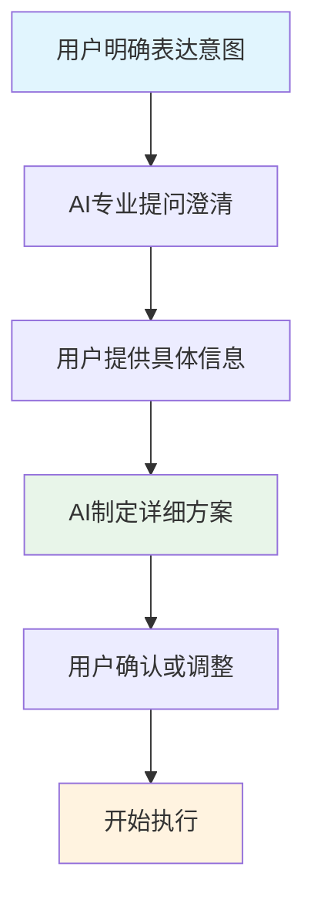

#### ✅ 好对话 vs ❌ 差对话

| 对话质量 | 用户表达 | AI回应 | 结果 |
|----------|----------|---------|-------|
| ✅ **高质量** | 明确意图+开放细节 | 专业提问+具体方案 | 高效解决 |
| ❌ **低质量** | 模糊需求+封闭信息 | 猜测回答+通用建议 | 反复沟通 |

---

## 🔰 基础提问原则

### 1. 准确性原则
- **具体 > 模糊**：说出具体要做什么，而非泛泛而谈
- **完整 > 片面**：提供足够的信息让AI理解全貌
- **清晰 > 复杂**：用简洁明了的语言表达需求

### 2. 上下文原则
- **背景信息**：项目类型、技术栈、目标用户
- **当前状态**：已有代码、遇到的问题、尝试过的方案
- **期望结果**：想要达到的具体效果

### 3. 渐进性原则
- **从简到繁**：先解决核心问题，再优化细节
- **分步骤**：将复杂任务分解为可管理的小步骤
- **验证式**：每步完成后验证结果再进行下一步

---

## 需求记录最佳实践

### 核心策略：混合模式根据复杂度选择

#### 🎯 决策树：何时用文档 vs 终端直接输入

```
需求复杂度评估：

简单需求 (终端直接输入)：
├── 单一功能修改
├── Bug修复  
├── 代码解释
├── 简单咨询
└── 快速原型验证

复杂需求 (先创建文档)：
├── 新项目开发
├── 多模块系统
├── 长期开发计划
├── 多人协作项目
└── 需求不明确的探索性项目
```

### A. 让AI主导需求分析的最佳方式

#### 🚀 启动需求分析会话
```
# 方式1：产品经理模式
"我有个项目想法但还不够清晰，请担任产品经理的角色，通过专业提问帮我完善需求"

# 方式2：技术顾问模式  
"我想做个[大概描述]，但不确定具体怎么实现，请：
1. 分析这个想法的可行性
2. 提出几种不同的实现方案
3. 推荐最适合的技术选型
4. 列出开发的优先级顺序"

# 方式3：引导式分析
"我有个模糊的想法：[1-2句描述]，请通过提问帮我：
- 明确目标用户和使用场景
- 确定核心功能和优先级
- 选择合适的技术方案
- 制定开发计划"
```

#### 🎪 让AI提供建议和方案
```
# 开放式咨询
"我遇到的问题：[描述现状]
希望达到的效果：[理想状态]
请分析问题并提供多种解决方案，包括技术选型建议"

# 方案比较
"对于[具体场景]，请比较以下几种方案的优缺点：
A. [方案A]
B. [方案B] 
C. [方案C]
并推荐最适合的方案"
```

### B. 终端友好的需求表达技巧

#### 📝 结构化短句法
```
# 项目信息快速模板
项目：[项目名称和类型]
用户：[目标用户群体]
核心功能：
- [功能1]（简要说明）
- [功能2]（简要说明）  
- [功能3]（简要说明）
技术栈：[前端] + [后端] + [数据库]
特殊要求：[性能/安全/兼容性等]
```

#### 🔄 分批次描述法
```
# 第一轮：项目概要
我想做个任务管理工具，主要给程序员用来跟踪项目进度

# 第二轮：等AI提问后补充细节
用户：个人和小团队
功能：项目管理、时间跟踪、Git集成
平台：桌面应用，需要跨平台

# 第三轮：根据AI建议确定技术方案
选择Electron + React + SQLite方案
需要详细的开发计划和实现步骤
```

### C. 工作流程最佳实践

#### 🎯 推荐的完整流程

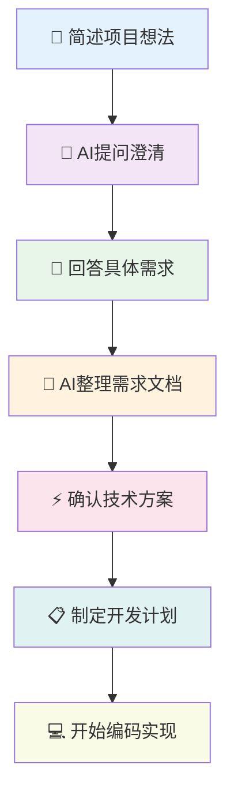

#### 📋 各阶段操作模板

**第一步：想法表达**
```
"我想做个[项目类型]来解决[什么问题]
主要用户是[用户群体]
请问我一些问题来完善这个想法"
```

**第二步：需求细化**
```
[回答AI的问题，提供具体信息]
"请继续问我需要澄清的问题"
```

**第三步：文档生成**
```
"请将我们讨论的内容整理成完整的需求文档，包括：
- 项目概述
- 功能需求
- 技术要求
- 开发计划"
```

**第四步：方案制定**
```
"基于需求文档，请制定：
- 详细的技术方案
- 系统架构设计
- 分阶段开发计划
- 项目文件结构"
```

### D. 特殊场景的处理方法

#### 🤔 需求完全不明确时
```
"我想改善[某个领域]的体验，但不知道该做什么产品
请帮我：
1. 分析这个领域的常见痛点
2. 提出几种可能的解决方案
3. 评估每种方案的可行性
4. 推荐最有价值的方向"
```

#### 🔧 现有项目优化时
```
"我的项目[项目描述]目前存在[问题列表]
请帮我：
1. 分析问题的根本原因
2. 提出改进方案的优先级
3. 估算改进的工作量
4. 制定逐步优化的计划"
```

#### 🚀 学习新技术时
```
"我想学习[技术名称]并用它做一个实际项目
请帮我：
1. 推荐适合初学者的项目类型
2. 设计学习路径和里程碑
3. 提供每个阶段的练习项目
4. 给出学习资源和最佳实践"
```

### E. 避免的常见误区

#### ❌ 不要做的事情
```
# 过于简单粗暴
"帮我写个网站" ❌

# 过于复杂冗长  
"我想做一个集成了用户管理、商品管理、订单系统、支付功能、
物流跟踪、数据分析、权限控制、API接口、移动端适配、
微服务架构、容器化部署的电商平台..." ❌

# 缺乏上下文
"这个bug怎么修？" ❌

# 技术选型过于死板
"必须用React + Node.js + MongoDB，不接受其他方案" ❌
```

#### ✅ 正确的做法
```
# 结构化描述
"我想做个电商平台，核心功能是商品展示和在线购买
目标用户是小商家，需要简单易用的后台管理
请帮我分析需求并推荐技术方案" ✅

# 开放式技术选型
"项目需要支持高并发和快速开发，你推荐什么技术栈？" ✅

# 完整的问题描述
"登录功能出现异常，错误信息：[完整日志]
复现步骤：[具体操作]
请帮我分析原因" ✅
```

---

## 提问技巧详解

### A. 需求描述技巧

#### ✅ 好的提问方式
```
我想要创建一个用户管理系统，包含：
- 用户注册和登录功能
- 用户信息的增删改查
- 权限管理
- 使用React + Node.js + MongoDB
- 需要响应式设计适配移动端
```

#### ❌ 避免的提问方式
```
帮我做个网站
写个用户系统
优化一下代码
```

### B. 获得反问的技巧

#### 故意保持适度模糊
```
"我想做个博客系统，请问我一些问题来了解具体需求"
"我的项目有性能问题，你需要了解什么信息？"
```

#### 直接请求分析
```
"帮我分析这个需求的可行性，有什么需要澄清的？"
"请提出问题帮我完善这个想法"
```

### C. 上下文提供技巧

#### 项目信息模板
```
项目类型：[Web应用/移动应用/桌面软件/等]
技术栈：[前端/后端/数据库/等具体技术]
项目规模：[个人项目/小团队/企业级/等]
目标用户：[具体描述用户群体]
主要功能：[核心功能列表]
```

#### 问题描述模板
```
遇到问题：[具体错误或现象]
错误信息：[完整的错误日志]
复现步骤：[1. 2. 3. ...]
期望行为：[应该发生什么]
环境信息：[操作系统、版本等]
```

---

## 提问顺序和流程

### 1. 新项目开发流程

#### 第一阶段：需求分析
```
1. 项目概述 → "我想开发一个[项目类型]，主要用来[解决什么问题]"
2. 等待反问 → 回答技术细节和具体需求
3. 确认方案 → "请制定详细的技术方案和开发计划"
```

#### 第二阶段：方案制定
```
1. 技术选型 → 让AI分析并推荐合适的技术栈
2. 架构设计 → 确定系统架构和模块划分
3. 开发计划 → 制定详细的任务清单和时间安排
```

#### 第三阶段：开发执行
```
1. 环境搭建 → 创建项目结构和配置环境
2. 核心功能 → 按优先级开发主要功能
3. 测试验证 → 每个阶段完成后进行测试
4. 优化完善 → 性能优化和用户体验改进
```

### 2. 问题解决流程

#### 诊断阶段
```
"我遇到了[具体问题]，错误信息是：[粘贴完整错误]
请帮我分析可能的原因"
```

#### 解决阶段
```
"请提供几种解决方案，并说明各自的优缺点"
"我选择方案X，请帮我实现"
```

#### 验证阶段
```
"请帮我测试这个解决方案"
"如何预防这类问题再次发生？"
```

### 3. 代码审查流程

#### 审查请求
```
"请审查这段代码：[代码片段]
关注点：[性能/安全性/可维护性/等]"
```

#### 改进建议
```
"基于审查结果，请提供具体的改进建议"
"帮我重构这段代码，使其更符合最佳实践"
```

---

## 上下文管理策略

> 🎯 **核心问题**：Claude Code对话中断后，如何让AI快速恢复之前的工作状态？  
> 💡 **解决方案**：通过项目文档体系和标准化流程，实现无缝的上下文管理。

### A. 为什么需要上下文管理？

#### 🤔 常见困扰场景
```
❌ 痛苦场景1：
昨天和Claude讨论了2小时的项目架构，今天重新开始时：
- Claude完全不记得之前的讨论
- 需要重新解释整个项目背景
- 浪费大量时间重复说明

❌ 痛苦场景2：
项目进行到一半，浏览器崩溃或网络中断：
- 所有的讨论历史丢失
- 不知道当前进展到哪一步
- 重要的技术决策记录消失
```

#### ✅ 理想的工作状态
```
✅ 完美场景：
重新打开Claude Code时，直接说：
"继续开发我的电商项目"

Claude立即回应：
"好的！我看到你的项目当前状态：
- 已完成：用户注册、商品展示
- 正在进行：购物车功能开发
- 下一步：支付集成
- 技术栈：React + Node.js + MongoDB
需要我继续哪个部分？"
```

### B. 长对话的连贯性管理

#### 🔄 定期总结（每30-60分钟）

**触发时机：**
- 完成一个主要功能模块
- 解决一个复杂问题
- 对话超过30分钟
- 准备结束当前会话

**标准操作：**
```
# 方式1：主动总结
"我们刚刚完成了用户注册功能，请总结：
1. 已完成的具体工作
2. 使用的技术方案
3. 遇到的问题和解决方案
4. 下一步的计划
5. 将这些信息更新到CLAUDE.md"

# 方式2：状态更新  
"请更新项目状态：
- 当前阶段完成情况
- 技术决策记录
- 待解决的问题列表
- 优先级调整"
```

**实际例子：**
```
👤 用户：我们刚刚完成了用户注册功能，请总结一下进展

🤖 Claude回应：
好的！让我总结一下用户注册功能的完成情况：

## 已完成工作
✅ **前端注册表单**
- 使用React Hook Form进行表单验证
- 实现密码强度检查
- 添加邮箱格式验证

✅ **后端API开发**
- POST /api/auth/register 接口
- 密码bcrypt加密存储
- 邮箱唯一性检查
- JWT token生成

✅ **数据库设计**
- users表结构：id, email, password, created_at
- 建立邮箱唯一索引

## 技术决策记录
- 选择JWT而非Session（考虑后续移动端扩展）
- 密码加密使用bcrypt（盐轮数12）
- 前端状态管理使用Context API

## 下一步计划
1. 用户登录功能
2. 邮箱验证机制
3. 密码重置功能

我现在将这些信息更新到CLAUDE.md...
```

#### 📝 文档自动记录

**触发Claude记录的方法：**
```
# 自动文档更新
"请将我们的讨论要点自动记录到：
1. CLAUDE.md - 项目概述更新
2. DEVELOPMENT_LOG.md - 今天的开发记录  
3. CURRENT_STATUS.md - 当前状态更新"

# 决策记录
"刚刚我们决定使用Redux而不是Context API，请：
1. 记录这个技术决策的原因
2. 更新技术栈文档
3. 调整开发计划的相关部分"
```

### C. 中断恢复策略

#### 💾 会话结束前的标准操作

**会话结束检查清单：**
```
# 结束前必做（复制这个模板使用）
"我准备结束今天的开发会话，请帮我：

📋 状态保存：
1. 总结今天完成的具体工作
2. 记录当前正在进行的任务
3. 列出下次开始时的第一个任务
4. 更新所有项目文档

⚠️ 问题记录：
1. 记录未解决的技术问题
2. 标记需要进一步调研的点
3. 记录临时的workaround方案

📅 下次计划：
1. 明确下次会话的优先任务
2. 预估各任务的时间需求
3. 识别可能的阻塞点"
```

**实际操作示例：**
```
👤 用户：我要下班了，请帮我保存当前状态

🤖 Claude：好的！我来为你整理今天的工作状态：

## 📊 今日工作总结
✅ **已完成**：
- 用户注册API开发（100%）
- 前端注册表单（100%）  
- 单元测试编写（80%）

🔄 **进行中**：
- 邮箱验证功能（60%完成）
  - 已完成：邮件模板设计
  - 进行中：发送邮件逻辑
  - 待完成：验证链接处理

## 🚨 待解决问题
1. 邮件服务配置（Nodemailer vs SendGrid选择）
2. 验证邮件的过期时间设置
3. 用户未验证邮箱的状态处理

## 🎯 明天首要任务
1. **第一优先级**：完成邮箱验证发送功能
2. **第二优先级**：实现邮箱验证确认
3. **第三优先级**：添加相关的错误处理

我已将这些信息更新到项目文档中。明天直接说"继续开发用户系统"即可快速恢复！
```

#### 🔄 会话恢复的标准流程

**重新开始时的操作：**
```
# 简单恢复
"继续开发[项目名]"

# 详细恢复  
"我要继续开发电商项目，请：
1. 回顾项目当前状态
2. 确认下一步优先任务
3. 检查是否有新的依赖或变更"

# 特定任务恢复
"继续开发用户邮箱验证功能，上次我们讨论到邮件发送部分"
```

### D. 项目文档体系详解

> 💡 **重点理解**：这些文档不是你手动创建的，而是让Claude自动生成和维护的！

#### 📁 文档生成的完整时间线

**阶段1：项目启动时（第1次对话）**
```
👤 用户启动：
"我想开发一个电商网站，请担任产品经理帮我完善需求，并创建项目文档体系"

🤖 Claude操作：
1. 通过提问完善需求
2. 制定技术方案
3. 自动创建：CLAUDE.md（项目概述）
4. 自动创建：PROJECT_PLAN.md（开发计划）
5. 自动创建：CURRENT_STATUS.md（当前状态）
```

**阶段2：开发过程中（每次会话）**
```
👤 用户请求：
"完成用户注册功能后，请更新项目文档"

🤖 Claude操作：
1. 更新：CURRENT_STATUS.md（进度状态）
2. 添加：DEVELOPMENT_LOG.md（今日开发记录）
3. 更新：CLAUDE.md（技术决策记录）
4. 创建：NEXT_STEPS.md（下一步计划）
```

**阶段3：问题解决时（遇到技术难点）**
```  
👤 用户说明：
"解决了Redis连接问题，请记录解决方案"

🤖 Claude操作：
1. 更新：DEVELOPMENT_LOG.md（问题和解决方案）
2. 创建：TROUBLESHOOTING.md（故障排除指南）
3. 更新：CLAUDE.md（经验教训）
```

#### 📋 各文档的具体内容和生成方式

**1. CLAUDE.md - 项目大脑（最重要）**
```
# 何时生成：项目开始时自动创建，每次重大更新时维护
# 触发方式：
"请创建项目的CLAUDE.md文件，包含完整的项目信息"

# 文档内容示例：
# 电商项目 - Claude协作记录

## 项目概述
- 项目名称：简约电商平台
- 技术栈：React + Node.js + MongoDB + Redis
- 目标用户：小型商家
- 核心功能：商品管理、订单处理、用户系统

## 开发进展
- 当前阶段：用户系统开发
- 已完成：项目搭建、数据库设计、用户注册
- 进行中：邮箱验证
- 下一步：用户登录、商品管理

## 技术决策记录
- 2024-XX-XX：选择JWT认证（原因：无状态，适合扩展）
- 2024-XX-XX：使用Redis缓存（原因：提升登录性能）

## 重要配置
- 数据库：mongodb://localhost:27017/ecommerce
- Redis：localhost:6379
- 端口：前端3000，后端3001

## AI协作经验
- 有效提问模式：先描述现象，再提供错误信息
- 好用的模板：技术选型对比模板
- 改进建议：每个功能完成后及时记录
```

**2. DEVELOPMENT_LOG.md - 开发日志**
```
# 何时生成：每次开发会话结束时
# 触发方式：
"请将今天的开发工作记录到DEVELOPMENT_LOG.md"

# 文档内容示例：
# 开发日志

## 2024-XX-XX - 用户注册功能
### 完成工作
- 创建User模型和数据表
- 实现注册API接口
- 开发前端注册表单
- 添加表单验证逻辑

### 遇到问题
- 密码加密：最初选择了md5，后改用bcrypt
- 表单验证：React Hook Form学习成本，但效果好

### 技术决策
- 密码加密：bcrypt，盐轮数12
- 表单验证：React Hook Form + yup
- 状态管理：Context API（暂时够用）

### 下次任务
- 邮箱验证功能
- 用户登录接口
```

**3. CURRENT_STATUS.md - 实时状态**
```
# 何时生成：每次状态变化时自动更新
# 触发方式：
"请更新CURRENT_STATUS.md反映最新进展"

# 文档内容示例：
# 项目当前状态

## 开发阶段：用户系统开发 (第2周)

## 完成度概览
- 项目搭建：✅ 100%
- 用户注册：✅ 100%  
- 邮箱验证：🔄 60%
- 用户登录：⏳ 0%
- 商品管理：⏳ 0%

## 当前任务
正在开发：邮箱验证功能
- 邮件模板：✅ 完成
- 发送逻辑：🔄 开发中  
- 验证处理：⏳ 待开始

## 阻塞问题
- 邮件服务选择：需要决定Nodemailer vs SendGrid
- 验证链接安全：需要设计token过期机制

## 下一里程碑
目标：本周完成用户系统（注册+验证+登录）
预计完成时间：3天
风险：邮件服务配置可能需要额外调试时间
```

#### 🛠️ 如何让Claude自动维护这些文档？

> 💡 **关键理解**：不是你去写这些文档，而是**教会Claude在合适的时机自动生成和更新文档**

##### 📖 具体操作方式详解

**第一步：建立文档更新习惯**

每当完成重要工作时，养成这个习惯：
```
👤 你说：我们刚完成了用户登录功能，请更新项目文档

🤖 Claude会：
1. 自动分析刚才的工作内容
2. 更新CURRENT_STATUS.md（标记登录功能为完成）
3. 在DEVELOPMENT_LOG.md添加今日工作记录
4. 更新CLAUDE.md（添加技术决策和进展）
5. 如果需要，创建或更新其他相关文档
```

**第二步：使用"魔法指令"让Claude理解你的意图**

创建几个标准指令，Claude会记住并执行：
```
# 指令1：全面文档更新
👤 "执行标准文档更新流程"

🤖 Claude理解为：
- 回顾本次会话的重要内容
- 识别需要记录的技术决策
- 更新项目进度状态
- 添加开发日志条目
- 更新项目概述信息

# 指令2：会话结束保存
👤 "准备结束今天的开发会话"

🤖 Claude理解为：
- 总结今天完成的所有工作
- 记录遇到的问题和解决方案
- 明确下次开始的第一个任务
- 更新所有相关文档
- 保存当前项目状态

# 指令3：项目恢复
👤 "继续开发[项目名]"

🤖 Claude理解为：
- 读取CLAUDE.md了解项目概况
- 查看CURRENT_STATUS.md获取当前状态
- 检查DEVELOPMENT_LOG.md了解最近进展
- 确认下一步要做的任务
```

**第三步：训练Claude记住你的项目**

使用Memory功能让Claude记住重要信息：
```
# 项目启动时设置基础记忆
👤 你说：
"/memory set project_name='我的电商平台'
/memory set tech_stack='React + Node.js + MongoDB'
/memory set doc_update_style='每个功能完成后自动更新'
/memory set main_doc='CLAUDE.md'"

# 之后Claude就会：
- 在合适时机主动提醒更新文档
- 知道你的项目基本信息
- 理解你的文档管理偏好
```

##### 🎯 实战示例：完整的文档自动化流程

**场景：开发一个博客系统的第3天**

```
=== 上午9点：恢复工作 ===
👤 "继续开发个人博客项目"

🤖 "好的！我查看了项目文档：
📋 项目状态：
- 已完成：项目搭建、用户注册功能
- 昨天完成：用户登录API
- 今天计划：实现文章发布功能

📝 技术栈：React + Express + MongoDB
📂 当前分支：feature/article-management

需要开始文章发布功能的开发吗？"

=== 下午2点：功能完成后 ===
👤 "文章发布功能开发完成，请更新项目文档"

🤖 "好的！我来更新项目文档：

✅ 已更新CURRENT_STATUS.md：
- 文章发布功能：✅ 完成（新增）
- 下一个任务：文章列表和详情页

✅ 已更新DEVELOPMENT_LOG.md：
添加了2024-01-15的开发记录：
- 完成文章CRUD API
- 实现富文本编辑器集成
- 添加图片上传功能

✅ 已更新CLAUDE.md：
- 技术决策：选择Quill.js作为富文本编辑器
- 新增API接口文档链接
- 更新开发进度

项目文档已同步更新完成！"

=== 晚上6点：准备下班 ===
👤 "准备结束今天的开发会话"

🤖 "好的！让我为你整理今天的工作状态：

📊 今日工作总结：
✅ 完成：文章发布功能（包含富文本编辑、图片上传）
✅ 完成：API接口测试和文档更新
🔄 进行中：无（今日任务已完成）

📝 技术亮点：
- 成功集成Quill.js富文本编辑器
- 实现了图片上传和预览功能
- API响应时间优化到200ms以内

🎯 明天首要任务：
1. 开发文章列表页面（优先级：高）
2. 实现文章详情页面
3. 添加文章分类功能

📋 文档更新状态：
✅ CLAUDE.md - 已更新项目概述和技术决策
✅ CURRENT_STATUS.md - 已更新完成状态
✅ DEVELOPMENT_LOG.md - 已添加今日详细记录
✅ NEXT_STEPS.md - 已创建明日任务清单

明天直接说'继续开发博客项目'即可快速恢复！休息愉快！"
```

##### 💡 让文档自动化的关键技巧

**技巧1：建立固定的"触发词"**
```
这些词Claude会自动理解为要更新文档：
- "功能开发完成" → 自动更新进度状态
- "遇到问题已解决" → 自动记录到问题解决日志
- "技术方案确定" → 自动记录技术决策
- "准备结束会话" → 自动执行状态保存流程
```

**技巧2：让Claude形成"文档意识"**
```
在项目开始时明确告诉Claude：
"这个项目我希望你能：
1. 在每个重要节点主动提醒我更新文档
2. 自动记录我们讨论的技术决策
3. 保持项目状态的实时更新
4. 在我准备结束会话时自动保存状态"

Claude会记住这个偏好，在合适时候主动操作
```

**技巧3：验证文档是否真的在更新**
```
偶尔检查一下：
👤 "显示CLAUDE.md的最新内容"
👤 "检查项目当前状态"

这样确保文档确实在自动维护
```

### E. 实战演示：完整的上下文管理流程

**场景：开发一个博客系统**

```
=== 第1天：项目启动 ===
👤 "我想开发个人博客，请创建完整的项目文档体系"

🤖 Claude创建：
- CLAUDE.md（项目概述）
- PROJECT_PLAN.md（4周开发计划）  
- CURRENT_STATUS.md（当前状态：项目启动）

=== 第2天：开始开发 ===  
👤 "继续开发博客项目"

🤖 "好的！我看到项目状态：
- 当前阶段：环境搭建（第1周）
- 下一任务：创建React项目和基础路由
需要开始环境搭建吗？"

=== 第3天：功能完成后 ===
👤 "文章列表页面开发完成，请更新文档"

🤖 自动更新：
- CURRENT_STATUS.md：文章列表✅完成
- DEVELOPMENT_LOG.md：添加今日开发记录
- CLAUDE.md：更新进展概述

=== 第4天：遇到问题时 ===
👤 "解决了Markdown渲染的性能问题，请记录解决方案"

🤖 更新：
- DEVELOPMENT_LOG.md：记录问题和解决方案
- 新建：PERFORMANCE_OPTIMIZATION.md（性能优化记录）
- CLAUDE.md：添加经验教训

=== 第N天：项目恢复 ===
👤 "继续开发博客项目的评论功能"

🤖 "好的！我看到你的项目：
- 已完成：文章管理、用户认证、Markdown渲染
- 进行中：评论功能（已完成数据模型设计）
- 下一步：实现评论的CRUD接口
需要继续开发评论的API吗？"
```

## 💡 上下文管理的完整掌握路径

### 🎯 从理解到精通的学习步骤

**步骤1：理解核心概念（5分钟理解）**
```
✅ 核心问题：对话中断后如何恢复状态？
✅ 解决方案：让Claude自动生成和维护项目文档
✅ 关键原理：不是你写文档，而是训练Claude自动写
```

**步骤2：掌握基础操作（第一天实践）**
```
✅ 学会说"请更新项目文档" → Claude自动执行更新
✅ 学会说"准备结束会话" → Claude自动保存状态  
✅ 学会说"继续开发XX项目" → Claude自动恢复状态
```

**步骤3：建立自动化习惯（一周内养成）**
```
✅ 每完成一个功能 → 主动让Claude更新文档
✅ 每次遇到问题解决 → 让Claude记录解决方案
✅ 每次会话结束 → 让Claude保存当前状态
✅ 每次重新开始 → 直接说"继续开发"
```

**步骤4：精通高级技巧（持续优化）**
```
✅ 使用Memory功能设置项目记忆
✅ 建立个人的"魔法指令"库
✅ 让Claude形成主动提醒的习惯
✅ 验证和优化文档质量
```

### 📋 关键要点检查清单

在开始使用上下文管理之前，确保你理解了这些要点：

#### ✅ 概念理解检查
- [ ] **我理解了**：Claude Code的对话会中断，需要管理上下文
- [ ] **我明白了**：项目文档是让Claude自动生成的，不是我手写的
- [ ] **我知道了**：通过标准化指令可以训练Claude的行为
- [ ] **我懂得了**：Memory功能可以让Claude记住项目信息

#### ✅ 操作能力检查  
- [ ] **我会说**："请更新项目文档"让Claude自动更新
- [ ] **我会说**："准备结束今天的开发会话"让Claude保存状态
- [ ] **我会说**："继续开发XX项目"让Claude恢复工作
- [ ] **我会用**：/memory命令设置项目基础信息

#### ✅ 习惯养成检查
- [ ] **我承诺**：每完成重要功能都让Claude更新文档
- [ ] **我承诺**：每次会话结束都让Claude保存状态  
- [ ] **我承诺**：重新开始时先让Claude回顾项目状态
- [ ] **我承诺**：定期检查文档是否在正确更新

#### ✅ 效果验证检查
- [ ] **我能做到**：中断对话后快速恢复到之前的工作状态
- [ ] **我能做到**：让Claude清楚地知道项目当前进展
- [ ] **我能做到**：通过文档了解项目的完整开发历史
- [ ] **我能做到**：在任何时候都知道下一步要做什么

### 🚀 成功应用上下文管理的标志

当你成功掌握上下文管理后，你的工作体验会是这样的：

#### ✨ 理想的工作流程体验
```
=== 第1天 ===
👤 "我想开发一个任务管理应用"
🤖 [深度需求分析 + 自动创建项目文档]
👤 "准备下班，保存状态"
🤖 [自动总结进展 + 更新所有文档]

=== 第2天 ===  
👤 "继续开发任务管理应用"
🤖 "好的！昨天我们完成了需求分析和技术选型，今天开始环境搭建..."
[无缝恢复，无需重复说明]

=== 第N天 ===
👤 "继续开发"
🤖 "项目进展很好！当前已完成用户系统和任务CRUD，下一步是通知功能..."
[完美的连续性，就像从未中断过]
```

#### 🎯 你会感受到的改变
- **时间节约**：不再需要重复解释项目背景，节省80%的重启时间
- **状态清晰**：随时知道项目进展，不会遗忘重要决策
- **连续性强**：多日开发就像一次长对话，无缝衔接
- **记录完整**：自动积累项目历史，形成宝贵的开发经验库

### 💪 现在就开始实践！

**立即行动计划：**
1. **今天**：选择一个小项目开始实践上下文管理
2. **第一周**：养成文档更新的习惯
3. **第一月**：熟练掌握所有标准指令
4. **长期**：成为上下文管理的专家

记住：**上下文管理不是额外的工作负担，而是让你与Claude协作更高效的核心技能！**

掌握了这个技能，你就真正拥有了一个"永远记得项目状态"的AI编程伙伴！🎉

---

## 项目开发完整流程

> 🎯 **目标**：将前面学到的所有提问技巧整合成一套完整的项目开发流程  
> 💡 **核心理念**：让Claude从项目构思到上线部署全程参与，成为你最专业的开发伙伴

### 🌟 完整流程概览

```
💡 项目构思 → 🔍 需求分析 → 📋 方案设计 → ⚙️ 环境搭建 → 💻 功能开发 → 🧪 测试部署 → 🚀 上线维护
     ↓           ↓           ↓           ↓           ↓           ↓           ↓
   创意验证    文档创建    技术选型    项目初始化   迭代开发    质量保证    持续优化
```

### 阶段1：项目启动与需求分析 🚀

> **目标**：从模糊想法到清晰需求，建立项目文档体系

#### 🎯 第一步：项目构思验证

**你的操作：**
```
我有个项目想法：[1-2句话描述你的想法]

请担任产品经理和技术顾问，帮我：
1. 分析这个想法的市场价值和技术可行性
2. 通过专业提问完善需求细节
3. 识别潜在的技术难点和风险
4. 创建完整的项目文档体系

请开始你的专业分析和提问。
```

**Claude会做什么：**
- 深度分析项目可行性
- 提出3-5个关键问题澄清需求
- 分析目标用户和使用场景
- 识别核心功能和优先级

#### 📋 第二步：需求文档化

**你的操作：**
```
[回答Claude的所有问题后]

很好！基于我们的讨论，请：
1. 整理完整的项目需求文档
2. 创建CLAUDE.md作为项目大脑
3. 制定分阶段的开发计划
4. 设置项目的Memory信息

请确保文档包含项目概述、功能需求、技术约束、开发计划等完整信息。
```

**实际对话示例：**
```
👤 我有个项目想法：做一个程序员专用的任务管理工具

🤖 很有意思的想法！让我深入了解一下：

**市场分析：**
现有的任务管理工具很多，但针对程序员的确实不多见。这个细分市场有潜力。

**关键问题：**
1. 相比普通任务管理工具，程序员需要哪些特殊功能？
2. 你希望集成哪些开发工具？（Git、Jira、IDE等）
3. 个人使用还是团队协作？
4. 期望的技术栈是什么？
5. 预计多长时间完成？

请详细回答，我来帮你完善需求！

👤 [详细回答问题...]

🤖 好的！基于讨论，我来创建项目文档：

✅ **已创建CLAUDE.md** - 项目概述和技术方案
✅ **已创建PROJECT_PLAN.md** - 4周开发计划
✅ **已创建REQUIREMENTS.md** - 详细功能需求
✅ **已设置项目Memory** - 基础信息已保存

项目文档体系建立完成！下一步开始技术方案设计。
```

### 阶段2：技术方案设计 🔧

> **目标**：确定技术栈，设计系统架构，准备开发环境

#### 🛠️ 技术选型与架构设计

**你的操作：**
```
项目需求已经明确，现在请制定技术方案：

1. 推荐最适合的技术栈（前端、后端、数据库）
2. 设计系统架构图和数据库schema
3. 分析技术选择的优缺点和学习成本
4. 制定详细的开发环境搭建步骤
5. 创建项目的文件结构规划

请结合项目需求和我的技术背景给出最佳方案。
```

**Claude会提供：**
- 3-5种技术方案对比
- 推荐方案的详细理由
- 完整的系统架构设计
- 环境搭建的逐步指南

#### ⚙️ 环境搭建与项目初始化

**你的操作：**
```
技术方案确定了，请帮我：
1. 搭建开发环境（包含所有依赖安装）
2. 创建项目基础结构
3. 配置开发工具（ESLint、Prettier等）
4. 建立Git仓库和基础文档
5. 测试环境是否正常工作

遇到任何问题请及时告诉我解决方案。
```

### 阶段3：迭代开发执行 💻

> **目标**：按计划逐步开发功能，保持项目状态同步

#### 🔄 功能开发循环

每个功能的标准开发流程：

**开始功能开发：**
```
开始开发[具体功能名称]，请：
1. 回顾相关的需求和设计
2. 分解为具体的开发任务
3. 使用TodoWrite创建任务清单
4. 开始第一个任务的开发

如有技术问题随时提出，开发完成后请更新项目文档。
```

**功能完成确认：**
```
[功能名称]开发完成，请帮我：
1. 检查代码质量和最佳实践
2. 确认功能是否符合需求
3. 更新项目文档和开发进度
4. 规划下一个功能的开发

请确保代码质量达标再进入下一步。
```

**实际开发示例：**
```
👤 开始开发用户注册功能

🤖 好的！让我分解用户注册功能的开发任务：

📋 **任务清单**：
1. 设计用户数据模型
2. 创建注册API接口
3. 实现密码加密存储
4. 开发前端注册表单
5. 添加表单验证逻辑
6. 编写单元测试

让我们从第1个任务开始...

[完成后]
✅ 用户注册功能开发完成！
- 已实现所有计划功能
- 代码质量检查通过
- 已更新CLAUDE.md和DEVELOPMENT_LOG.md
- 下一个任务：用户登录功能

准备继续吗？
```

#### 📊 进度跟踪与状态管理

**每日/每周状态更新：**
```
请总结当前项目状态：
1. 已完成的功能列表
2. 正在进行的任务
3. 遇到的问题和解决方案
4. 下一阶段的优先任务
5. 整体进度评估

请更新所有项目文档反映最新状态。
```

**问题解决流程：**
```
遇到技术问题：[详细描述问题]

请帮我：
1. 分析问题的可能原因
2. 提供2-3种解决方案
3. 推荐最佳方案并说明理由
4. 协助实施解决方案
5. 记录问题和解决过程到文档
```

### 阶段4：测试与质量保证 🧪

> **目标**：确保代码质量，准备生产部署

#### ✅ 质量检查流程

**代码质量全面检查：**
```
项目核心功能开发完成，请进行全面质量检查：

**代码质量：**
1. 运行所有linting和type checking
2. 检查代码规范和最佳实践
3. 分析代码复杂度和可维护性
4. 识别潜在的性能问题

**功能测试：**
1. 验证所有功能是否正常工作
2. 测试各种边界条件
3. 检查错误处理机制
4. 确认用户体验流畅

**安全性检查：**
1. 扫描安全漏洞
2. 验证输入验证和数据保护
3. 检查身份认证和授权

请提供详细的检查报告和改进建议。
```

#### 🚀 部署准备

**生产环境准备：**
```
准备部署到生产环境，请帮我：
1. 优化构建配置和性能
2. 配置环境变量和生产设置
3. 准备部署脚本和CI/CD流程
4. 创建部署文档和操作手册
5. 制定回滚和监控计划

确保部署过程安全可靠。
```

### 阶段5：上线与持续优化 🌟

> **目标**：成功上线，建立维护机制

#### 📈 上线后的持续改进

**定期项目回顾：**
```
项目已上线[时间]，请进行全面回顾：

**项目成果：**
1. 功能完成情况和用户反馈
2. 技术方案的实际效果
3. 开发过程中的经验教训
4. 性能指标和使用数据

**持续改进：**
1. 识别需要优化的功能点
2. 规划下一阶段的功能迭代
3. 总结最佳实践和可复用模式
4. 更新项目文档和知识库

请生成完整的项目总结报告。
```

### 💡 完整流程的关键成功因素

#### ✅ 每个阶段必做的事情

1. **文档同步**：每个阶段结束都要更新项目文档
2. **状态保存**：重要节点要保存项目状态，便于恢复
3. **质量控制**：每个功能完成都要进行代码审查
4. **问题记录**：遇到问题要及时记录解决过程
5. **计划调整**：根据实际情况灵活调整开发计划

#### 🎯 流程成功的标志

当你熟练掌握这套流程后：
- **需求清晰**：项目开始前需求就很明确，很少返工
- **技术合理**：技术选型适合项目，开发过程顺利
- **进度可控**：随时知道项目进展，能准确预估完成时间
- **质量保证**：代码质量高，很少出现严重bug
- **文档完善**：项目有完整的文档，便于后续维护
- **经验积累**：每个项目都能积累可复用的经验和模式

### 🚀 立即开始你的第一个完整项目！

选择一个你感兴趣的项目，按照这个流程开始实践。记住：
- **不要求完美**：第一次使用这个流程，重点是熟悉整个过程
- **及时调整**：根据实际情况灵活调整流程细节
- **记录经验**：把使用过程中的心得记录下来，不断优化
- **持续改进**：每个项目结束后都要总结经验，改进流程

你现在拥有了一套完整的AI驱动开发流程，开始你的高效开发之旅吧！🎉

---

## 🌟 Claude Code高级功能

> 🎯 **将提问艺术提升到新高度：让每次对话都更高效、更智能！**

还记得我们在[基础提问原则](#基础提问原则)中学到的核心技巧吗？现在，通过Claude Code的2025年新功能，我们可以将这些提问艺术提升到全新的高度。

### 💡 核心理念：从"会问"到"巧问"

前面我们学会了**如何提问**，现在要学会**如何让提问更高效**：

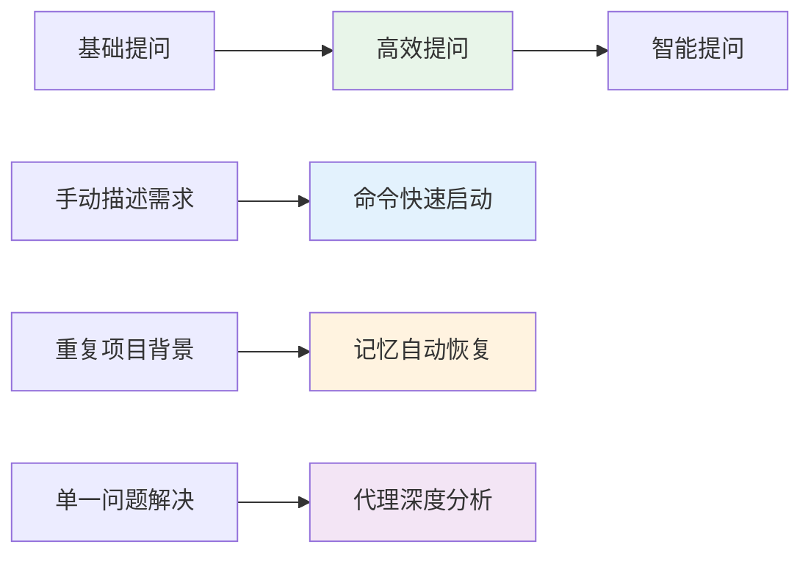

### 🚁 斜杠命令：让提问更简洁

> **核心价值**：用一个命令代替一大段解释

#### ⚡ 最实用的5个命令

| 命令 | 替代的冗长描述 | 提问艺术升级 |
|------|----------------|--------------|
| `/help` | "请告诉我有什么功能..." | → 一键获取指导 |
| `/memory` | "让我重新介绍一下我的项目..." | → 自动记住项目信息 |
| `/resume` | "我们之前在讨论..." | → 无缝恢复工作状态 |
| `/compact` | "请总结重点信息..." | → 智能压缩对话历史 |

#### 🎪 提问艺术实战升级

**升级前的笨拙提问：**
```
❌ 我昨天和你讨论了一个React项目，是关于电商网站的，
用的技术栈是React + Node.js + MongoDB，目标用户是小商家，
现在我想继续开发用户注册功能...
```

**升级后的智能提问：**
```
✅ /resume
继续开发电商项目的用户注册功能，请回顾项目状态并开始下一步
```

**再比如，项目启动时：**

**升级前：**
```
❌ 我想做个项目管理工具，请记住这些信息：项目名是TaskMaster，
技术栈用React和Node.js，用户是程序员，然后请问我一些问题...
```

**升级后：**
```
✅ /memory set project="TaskMaster项目管理工具"
/memory set tech_stack="React + Node.js"  
/memory set users="程序员团队"

我想做个程序员专用的项目管理工具，请担任产品经理角色，通过专业提问帮我完善需求
```

### 🧠 Memory管理：让AI永远记住你的项目

> **提问艺术进阶**：不再重复介绍项目背景，让对话聚焦在解决问题上

还记得我们在[上下文管理策略](#上下文管理策略)中学到的文档体系和项目记忆管理吗？Memory功能正是这些理念的自动化实现，让上下文管理变得前所未有的简单。

#### 🎯 解决的核心问题

**传统提问方式的痛点：**
```
❌ 每次都要重新介绍：
"我有个React项目，是电商网站，用的MongoDB数据库，
目标用户是小商家，现在开发到用户系统这里..."
```

**Memory管理后的提问：**
```
✅ 直接聚焦问题：
"用户注册时的邮箱验证逻辑应该怎么设计？"

（Claude已经知道你的项目背景）
```

#### 📝 建立项目记忆的最佳提问方式

**第一步：项目启动时设置记忆**
```
/memory set project_name="简约电商平台"
/memory set tech_stack="React + Node.js + MongoDB"
/memory set current_phase="用户系统开发"
/memory set target_users="小型商家"

现在开始我们的项目协作，你已经了解了基本信息，请回顾一下项目状态
```

**第二步：让Claude主动维护记忆**
```
每当我们完成一个重要功能或做出技术决策时，
请自动更新CLAUDE.md记录，包括：
- 完成的工作
- 技术选择的原因  
- 遇到的问题和解决方案
- 下一步计划

这样下次我直接说"继续项目开发"你就知道当前状态了。
```

#### 🔄 智能记忆工作流

**传统方式 vs Memory增强方式：**

| 阶段 | 传统提问方式 | Memory增强提问 | 效率提升 |
|------|-------------|---------------|----------|
| 项目启动 | 详细描述所有背景信息 | `/memory set` + 核心问题 | 节省70%时间 |
| 日常开发 | 重复说明项目背景 | 直接提出技术问题 | 聚焦解决方案 |
| 问题解决 | "我的XX项目遇到XX问题" | "遇到XX问题，请帮我解决" | 立即进入状态 |
| 项目恢复 | 重新介绍整个项目 | `/resume` 一键恢复 | 秒级恢复 |

#### 💡 Memory使用的高级技巧

**技巧1：分层记忆设置**
```
# 项目基础信息（很少变化）
/memory set project="电商平台"
/memory set tech="React+Node.js"

# 当前状态（经常更新）  
/memory set current_task="用户注册功能"
/memory set next_milestone="完成用户系统"

# 个人偏好（长期有效）
/memory set coding_style="函数式编程优先"
/memory set doc_preference="详细注释+README"
```

**技巧2：让Claude形成记忆习惯**
```
请记住我的协作偏好：
1. 每完成一个功能就更新项目状态
2. 重要技术决策要记录原因
3. 遇到问题要记录解决过程
4. 会话结束前保存当前进度

以后我只需要说"按标准流程更新"你就知道该做什么了。
```

### 🤖 子代理(Agent)：让提问变得更专业

> **提问艺术的终极形态**：不再是你问AI答，而是让专业的Agent深度分析问题

还记得我们在[需求记录最佳实践](#需求记录最佳实践)中提到的"让AI主导需求分析"吗？Agent功能将这个理念发挥到极致，实现了从简单问答到专业协作的质的飞跃。

#### 🎯 从普通提问到专业分析

**传统提问的局限：**
```
❌ 浅层对话：
你："我的网站很慢，怎么优化？"
AI："可能是图片太大，或者数据库查询效率低..."
你："那具体怎么检查？"
AI："你可以用XXX工具..."
（需要多轮对话才能深入）
```

**Agent增强的专业分析：**
```
✅ 深度分析：
你："网站性能有问题，请使用general-purpose agent进行全面分析"

Agent会：
1. 搜索所有相关的性能优化方案
2. 分析你的技术栈的特定优化点
3. 提供检测工具和具体步骤  
4. 给出优先级排序的行动计划
（一次性获得专业级的完整分析）
```

#### 💡 Agent增强的提问策略

**策略1：复杂问题的深度分析**
```
# 原始提问（效果有限）
❌ "React项目如何做性能优化？"

# Agent增强提问（专业分析）
✅ "请使用general-purpose agent分析我的React项目性能优化：
1. 搜索最新的React性能优化最佳实践
2. 分析我的项目特点（电商网站，有大量图片和数据）
3. 提供具体的检测和优化步骤
4. 给出优化效果的预期指标"
```

**策略2：技术选型的专业对比**
```
# 原始提问（主观回答）
❌ "React和Vue哪个更好？"

# Agent增强提问（客观分析）
✅ "请使用Agent对比分析React vs Vue用于我的项目：
- 项目背景：电商平台，需要SEO友好
- 团队情况：3人小团队，React经验较少
- 分析维度：学习成本、生态系统、SEO支持、项目适配度
- 输出：详细对比表格和推荐理由"
```

#### 🚀 Agent工作流：从提问到执行

**第一步：明确分析目标**
```
我需要Agent帮我分析[具体领域]的问题，
请搜索相关信息并提供专业级的分析报告
```

**第二步：指定分析范围**
```
请从以下角度进行分析：
1. [技术可行性]
2. [最佳实践] 
3. [风险评估]
4. [实施步骤]
5. [成功指标]
```

**第三步：要求可执行的结果**
```
请将分析结果整理成：
- 具体的行动清单
- 优先级排序
- 预期效果和风险
- 更新到项目文档
```

#### 🎭 实际应用场景

**场景1：技术难题突破**
```
遇到复杂的数据库查询优化问题，使用传统提问需要多轮对话。

Agent增强提问：
"请使用Agent深度分析MongoDB查询优化：
- 当前问题：聚合查询耗时5秒以上
- 数据规模：用户表100万条，订单表500万条  
- 查询类型：按时间范围统计用户订单数据
- 要求：提供完整的优化方案和预期效果"

结果：一次性获得专业级的数据库优化方案
```

**场景2：架构设计决策**
```
需要为项目选择合适的架构，传统提问容易得到主观建议。

Agent增强提问：
"请使用Agent分析微服务 vs 单体架构的选择：
- 项目规模：预计20个API接口，3-5个核心模块
- 团队规模：5人开发团队
- 业务需求：需要快速迭代，部分模块可能高并发
- 分析要求：客观对比，给出具体的判断标准和建议"

结果：基于数据和最佳实践的专业架构建议
```

### 🔌 MCP集成：扩展AI能力

#### 💡 MCP在提问艺术中的应用

**数据库集成场景**
```
我的项目需要设计数据库schema，请：
1. 使用MCP连接数据库工具
2. 分析我的业务需求
3. 设计优化的表结构
4. 生成建表SQL脚本
5. 提供数据迁移建议
```

**API开发场景**
```
需要集成第三方API，请通过MCP：
1. 搜索API文档和示例
2. 生成集成代码模板
3. 处理错误和边界情况
4. 编写API测试用例
5. 更新项目文档
```

### 🏃‍♂️ 高级功能组合技巧

#### 🎭 完整工作流示例

**超级项目启动流程：**

```
# 第1步：设置项目记忆
/memory set project_name="智能代办应用"
/memory set stage="需求分析"

# 第2步：AI引导需求分析
我想开发一个智能代办应用，请担任产品经理角色，通过专业提问帮我完善需求。
同时请：
1. 将讨论内容自动保存到CLAUDE.md
2. 使用Agent搜索类似产品的最佳实践
3. 制定技术选型建议

# 第3步：方案制定和记录
基于分析结果，请：
1. 制定详细的开发计划
2. 更新项目记忆状态
3. 创建任务清单
4. 规划里程碑节点

# 第4步：开始开发
/memory update stage="开发实施"
开始执行开发计划，请：
1. 搭建项目架构
2. 实现第一个核心功能
3. 持续更新开发进度
4. 遇到问题时自动记录解决方案
```

#### ⚡ 效率提升对比

| 传统方式 | 高级功能增强 | 效率提升 |
|----------|-------------|----------|
| 重复描述需求 | /resume自动恢复 | 90%时间节省 |
| 手动记录进度 | CLAUDE.md自动更新 | 80%工作量减少 |
| 单一问题解决 | Agent深度搜索 | 3倍质量提升 |
| 上下文丢失 | Memory永久保存 | 100%连贯性 |

### 🎓 高级功能学习路径

#### 📈 递进式掌握计划

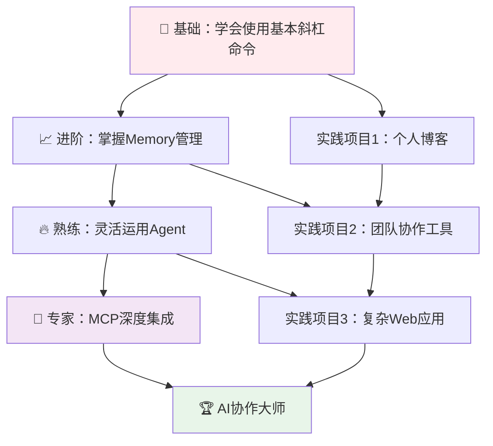

#### 🏋️‍♂️ 高级功能练习

**练习1：Memory管理实战**
1. 创建一个项目的完整CLAUDE.md
2. 使用/memory命令管理项目状态
3. 练习/compact和/resume的配合使用

**练习2：Agent协作项目**
1. 使用Agent完成复杂需求分析
2. 让Agent帮你搜索和整合技术方案
3. 实践Agent在代码实现中的应用

**练习3：工作流优化**
1. 设计你的专属AI协作工作流
2. 结合斜杠命令优化日常开发
3. 建立项目模板和最佳实践库

### 💡 高级技巧总结

#### 🎯 核心原则
1. **自动化优先**：能用命令解决的不手动操作
2. **记忆驱动**：重要信息永远不丢失
3. **专业分工**：复杂任务交给专业Agent
4. **流程标准化**：建立可复用的协作模式

#### 🚀 最佳实践
- 每个项目都建立完整的Memory体系
- 定期使用/compact优化上下文
- 善用Agent处理复杂和重复性任务  
- 建立个人的命令和模板库

通过掌握这些高级功能，你将从AI协作新手成长为真正的专家！🏆

---

## ⚡ IDE集成与GitHub Actions (2025新增功能)

> 🎯 **将提问艺术从终端带到IDE：让AI成为你编码过程中的实时伙伴！**

掌握了命令行中的提问技巧和[项目开发完整流程](#项目开发完整流程)后，现在让我们把这些技能无缝扩展到日常开发环境中，实现真正的一体化AI协作开发。

### 💡 核心理念：从"对话式编程"到"协作式编程"

**传统方式 vs IDE集成方式：**

| 开发环节 | 传统方式 | IDE集成提问 | 效率提升 |
|----------|----------|------------|----------|
| 代码审查 | 切换到终端描述问题 | 选中代码直接提问 | 即时反馈 |
| Bug修复 | 复制代码到聊天界面 | IDE中原地分析 | 无缝体验 |
| 代码重构 | 手动解释代码上下文 | IDE自动提供上下文 | 精准分析 |

### 🔧 IDE集成：提问艺术的自然延伸

#### 💻 VS Code中的智能提问

**场景1：代码质量检查**
```
# 不再需要复制粘贴代码，直接选中问题代码段：

选中代码 → 右键 → "Ask Claude"

提问："这段代码的性能可以优化吗？请：
1. 分析当前的性能瓶颈
2. 提供具体的改进方案  
3. 直接在代码中实现修改
4. 解释优化的原理"
```

**场景2：智能重构建议**
```
# 基于代码上下文的智能提问：

在函数上右键 → "Refactor with Claude"

"请分析这个函数并提供重构建议：
- 考虑当前项目的代码风格（Claude已知项目上下文）
- 保持功能不变的前提下优化结构
- 提高可读性和可维护性
- 直接应用最佳的重构方案"
```

#### 🚀 JetBrains系列的协作提问

**结合IDE强大功能的提问策略：**
```
# 利用IntelliJ的智能提示结合Claude的分析

"基于IDE检测到的代码警告，请：
1. 分析这些警告的根本原因
2. 提供符合Java最佳实践的解决方案
3. 使用IntelliJ的重构工具进行修改
4. 确保修改后通过所有静态分析检查"
```

### 🤖 GitHub Actions：让提问自动化

> **核心思想**：把你的提问策略自动化，让AI在后台持续工作

#### 📋 智能代码审查流程

还记得我们在[代码审查模板](#实用模板和示例)中学到的审查技巧吗？现在可以自动化了：

```yaml
# .github/workflows/intelligent-review.yml
name: Claude智能审查
on:
  pull_request:
    types: [opened, synchronize]

jobs:
  claude-review:
    runs-on: ubuntu-latest
    steps:
      - name: 智能代码审查
        uses: anthropic/claude-code-action@v1
        with:
          task: |
            请按照我们项目的审查标准审查这个PR：
            
            **审查重点**（基于项目CLAUDE.md中的代码规范）：
            1. 代码质量：遵循项目编码规范
            2. 性能考虑：识别潜在的性能问题
            3. 安全检查：检查常见安全漏洞
            4. 测试覆盖：确保关键逻辑有测试
            
            **输出格式**：
            - 问题清单（按优先级排序）
            - 具体修改建议（包含代码示例）
            - 通过/需要修改的结论
```

#### 🎯 智能项目管理自动化

**自动化的提问流程：**
```yaml
# 每天自动分析项目状态
- name: 项目状态分析
  run: |
    claude-code "
    请分析项目当前状态并生成日报：
    
    **分析内容**：
    1. 检查昨天的提交和PR
    2. 分析代码质量趋势  
    3. 识别潜在的技术债务
    4. 提供今日开发建议
    
    **自动操作**：
    1. 更新DEVELOPMENT_LOG.md
    2. 发送状态报告到Slack
    3. 创建优化建议Issue（如果发现问题）
    "
```

### 💡 工作流整合：一天的智能开发体验

**完整的AI增强开发工作流：**

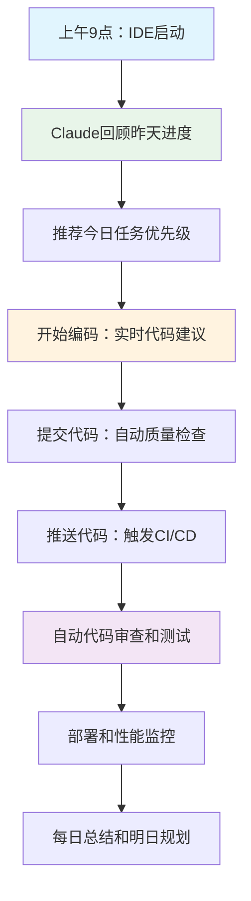

**实际体验：**
```
09:00 打开VS Code
      "继续昨天的用户系统开发，当前进度如何？"
      
10:30 编写登录逻辑时
      选中复杂的验证函数 → "这个逻辑可以简化吗？"
      
12:00 提交代码前  
      "检查本次提交的代码质量，确保符合项目规范"
      
15:00 收到GitHub通知
      "PR审查完成：发现2个优化建议，已自动修复1个"
      
18:00 准备下班
      "总结今日工作并规划明天任务"
```

---

## 🔌 MCP协议与扩展能力 (2025新增功能)

> 🎯 **让提问不再局限于代码：连接真实世界的数据和工具！**

还记得我们在[基础提问原则](#基础提问原则)中强调的"上下文原则"吗？MCP协议将这个概念扩展到极致——Claude不再需要你手动描述项目状态，而是可以直接访问真实的数据库、API、设计稿等，实现基于真实数据的智能协作。

### 💡 从"描述式提问"到"直接访问式协作"

**传统提问的局限：**
```
❌ 描述式提问：
"我的数据库有用户表，字段包括id、name、email、created_at，
现在想添加一个地址字段，应该怎么设计？"

（需要手动描述数据库结构，容易遗漏细节）
```

**MCP增强的直接协作：**
```
✅ 直接访问式协作：
"请连接数据库，分析用户表结构，为地址信息设计最佳的存储方案"

（Claude直接访问真实数据库，获得完整准确的信息）
```

### 🌐 MCP连接：扩展你的提问范围

#### 🎨 设计协作：从想法到代码

**传统方式：**
```
❌ 繁琐流程：
1. 在Figma中查看设计稿
2. 截图或描述给Claude
3. Claude基于描述给出代码建议
4. 手动对比设计稿和代码
```

**MCP增强：**
```
✅ 无缝协作：
"请连接Figma获取用户登录页面的最新设计，
分析设计要求并生成对应的React组件，
确保像素级还原并优化移动端适配"

（Claude直接访问设计稿，生成精确匹配的代码）
```

#### 📊 数据驱动的智能决策

**项目管理集成示例：**
```
# 连接Jira进行智能项目分析
"请连接我们的Jira项目，分析当前Sprint状态：

**分析目标**：
1. 识别可能延期的任务
2. 分析团队工作负载分布  
3. 预测Sprint完成情况
4. 提供优化建议

**自动操作**：
1. 更新项目进度到CLAUDE.md
2. 生成风险预警报告
3. 建议任务优先级调整"
```

#### 🛠️ 开发工具集成

**数据库操作的智能化：**
```
# 直接数据库协作
"请连接生产数据库（只读模式），分析用户行为数据：

**分析任务**：
1. 查看最近7天的用户活跃度
2. 识别最常用和最少用的功能
3. 分析性能瓶颈的SQL查询
4. 提供数据库优化建议

**安全要求**：
- 只访问聚合数据，不查看个人信息
- 所有查询记录到审计日志
- 提供数据脱敏的分析报告"
```

### 🚀 MCP工作流：真实项目的完整协作

#### 💼 端到端项目开发体验

**第一阶段：需求到设计**
```
"请帮我启动新项目的完整协作流程：

1. **连接Figma**：获取产品设计稿
2. **连接Jira**：创建开发任务
3. **分析设计**：提取技术需求
4. **生成方案**：制定开发计划
5. **创建文档**：建立项目CLAUDE.md

请确保所有信息都从真实源头获取，避免假设和猜测。"
```

**第二阶段：开发到部署**
```
"进入开发阶段，请：

1. **连接数据库**：创建表结构
2. **连接GitHub**：管理代码仓库
3. **连接AWS**：配置部署环境
4. **连接监控**：设置性能追踪

开发过程中实时同步状态到所有相关工具。"
```

### 💡 MCP的提问艺术升华

#### 🎯 从单点提问到生态协作

**传统单点提问：**
```
❌ 孤立的问题解决：
"这个API响应很慢，怎么优化？"
```

**MCP生态协作：**
```
✅ 全面生态分析：
"请通过MCP全面分析API性能问题：

**数据收集**：
- 连接APM工具获取性能指标
- 连接数据库分析查询性能
- 连接日志系统查看错误记录

**分析执行**：
- 识别性能瓶颈的根本原因
- 对比历史数据找出趋势
- 评估不同优化方案的效果

**行动建议**：
- 提供优先级排序的优化清单
- 自动创建相关的开发任务
- 设置性能监控预警规则"
```

#### 🔄 连续的智能协作循环

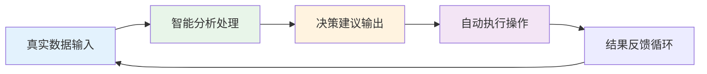

### 🏆 MCP协作的最终目标

通过MCP协议，你的提问从"描述问题"升华为"编排资源"：

- **不再描述**，而是**直接访问**
- **不再猜测**，而是**基于真实数据**  
- **不再孤立**，而是**整合生态系统**
- **不再被动**，而是**主动监控优化**

这就是2025年提问艺术的最高境界：**让AI成为连接一切的智能中枢！**🚀

---

## 💎 实用模板和示例

> 🎯 **精选的最实用提问模板：涵盖90%的开发场景**  
> 基于前面学到的提问艺术原理，这里整理了经过实战验证的高效模板，让你快速掌握各种场景下的提问技巧。

### 🚀 智能项目启动模板 ⭐

#### 万能启动模板（复杂项目）
```
我想开发一个[项目类型]，用来[解决的核心问题]。

基本情况：
- 目标用户：[用户群体和使用场景]
- 问题痛点：[当前的问题和困扰]
- 期望效果：[理想的解决方案效果]

初步想法：
- [想法1]
- [想法2] 
- [想法3]

限制条件：
- 时间：[开发周期要求]
- 技术：[技术栈偏好或限制]
- 资源：[人力和资金情况]

请担任产品经理，通过专业提问帮我：
1. 完善和优化需求
2. 分析技术可行性
3. 制定开发方案
4. 规划实施步骤
```

#### 2025增强版启动模板
```
/memory set project="[项目名称]"
/memory set goal="[核心目标]"
/memory set users="[目标用户]"

我想开发[项目描述]，请：
1. 担任产品经理角色，深度分析需求
2. 使用Agent搜索类似产品最佳实践
3. 制定包含2025新功能的开发方案
4. 建立完整的CLAUDE.md项目记忆体系
5. 设计IDE集成和自动化工作流
```

### ⚡ 1分钟快速启动模板

#### Web应用快速版
```
Web项目：[功能描述]
用户：[用户类型]  
技术：[前端]+[后端]+[数据库]
请问需要了解什么细节？
```

#### 移动应用快速版
```
移动App：[解决什么问题]
平台：[iOS/Android/跨平台]
核心功能：[3个以内主要功能]
请帮我分析技术方案
```

#### 工具开发快速版
```
开发工具：[工具用途]
输入：[处理什么数据]
输出：[期望结果]
语言：[编程语言偏好]
```

#### 学习项目快速版
```
学习[技术名称]：做[项目类型]练手
当前水平：[技术基础]
时间安排：[学习周期]
请推荐项目和学习路径
```

### 🐛 问题解决专业模板

#### 完整Bug报告模板
```
我遇到了一个bug，详情如下：

**问题描述：**
[简要描述问题现象]

**错误信息：**
```
[粘贴完整的错误日志]
```

**复现步骤：**
1. [第一步操作]
2. [第二步操作] 
3. [触发问题的操作]

**期望行为：**
[描述应该发生什么]

**环境信息：**
- 操作系统：[版本]
- 浏览器/运行环境：[版本]
- 项目版本：[版本号]

请帮我分析问题原因并提供解决方案。
```

#### 快速问题模板
**性能优化速查**
```
性能问题：[具体表现]
技术栈：[当前技术]
瓶颈点：[怀疑的问题]
目标：[优化期望]
```

**代码审查速查**
```
审查代码：[代码功能]
关注点：[重点方面]
标准：[项目规范]
请提供改进建议
```

### 🔥 2025新功能专用模板 ✨

#### IDE集成协作模板
```
请在IDE中协助我：

**当前任务：**[正在开发的功能]
**选中代码：**[已选中的代码段]

**协作需求：**
1. 分析代码质量和最佳实践
2. 提供性能优化建议
3. 实现自动重构和改进
4. 生成对应的测试用例
5. 更新相关文档和注释

请直接在IDE中实施改进方案。
```

#### MCP集成分析模板
```
请通过MCP连接进行综合分析：

**连接目标：**
- 数据库：[分析数据结构和性能]
- API服务：[检查集成状态]
- 项目管理：[同步开发进度]
- 设计工具：[获取最新设计稿]

**分析任务：**
1. 获取真实数据进行分析
2. 识别系统瓶颈和优化点
3. 生成数据驱动的改进建议
4. 自动更新项目文档和状态

**输出要求：**
- 详细分析报告
- 可执行的行动计划
- 自动化监控建议
```

#### GitHub Actions自动化模板
```
请设计GitHub Actions工作流：

**自动化目标：**
- 代码质量：[自动审查和修复]
- 测试覆盖：[运行测试和分析]
- 部署流程：[构建和发布]
- 文档更新：[自动生成和同步]

**触发条件：**
- Push到主分支
- PR创建和更新
- 定时任务执行

**集成要求：**
1. 与项目CLAUDE.md同步
2. 发送状态通知到团队
3. 自动创建Issue和PR
4. 生成性能和质量报告
```

### 🎯 高级协作模板

#### 技术选型对比模板
```
请帮我对比技术方案：

**项目背景：**[项目类型和规模]
**团队情况：**[技术水平和人员规模]

**候选方案：**
- 方案A：[技术栈1]
- 方案B：[技术栈2]
- 方案C：[技术栈3]

**对比维度：**
1. 学习成本和开发效率
2. 性能表现和扩展能力
3. 生态系统和社区支持
4. 长期维护和技术债务

**输出要求：**
- 详细对比表格
- 推荐方案及理由
- 风险评估和应对策略
```

#### 架构设计引导模板
```
请引导我设计系统架构：

**系统要求：**
- 功能模块：[核心功能列表]
- 性能指标：[并发、响应时间等]
- 扩展需求：[未来扩展计划]

**约束条件：**
- 技术限制：[必须或不能使用的技术]
- 资源限制：[人力、时间、预算]
- 业务限制：[合规、安全等要求]

**设计产出：**
1. 系统架构图
2. 技术栈选择
3. 数据库设计
4. API接口规划
5. 部署架构方案
```

### 💡 模板使用指南

#### 选择原则
- **简单任务**：使用快速模板
- **复杂项目**：使用完整模板  
- **2025新功能**：使用专用模板

#### 自定义方法
- 根据项目特点调整模板
- 添加特定的技术要求和约束条件
- 保存个人常用的模板变体

#### 效果评估
- 记录使用效果和AI回应质量
- 不断优化个人的模板库
- 形成专属的工作流程

### 🚀 立即开始使用这些模板！

**建议步骤：**
1. **选择**：根据当前需求选择合适的模板
2. **填写**：替换模板中的占位符为具体信息
3. **发送**：向Claude Code发送完整的提问
4. **迭代**：根据回应继续深入对话
5. **记录**：保存有效的对话和解决方案

**记住：模板只是起点，真正的提问艺术在于灵活运用和持续优化！**

---

## 高级技巧

### 1. 利用反馈机制
- 每次得到方案后，给出反馈："这个方案很好，但是能否考虑[具体建议]？"
- 要求比较方案："请比较A方案和B方案的优缺点"

### 2. 分层提问策略
- 战略层：项目整体规划和架构设计
- 战术层：具体功能实现和技术选择
- 操作层：代码编写和问题解决

### 3. 持续优化
- 定期回顾：项目进行中定期询问优化建议
- 学习总结：每个阶段结束后总结经验教训
- 知识积累：将有用的解决方案记录为模板

---

---

## 💡 最佳实践总结

### 核心原则（必须掌握）
1. **混合策略选择** - 简单需求直接问，复杂需求先整理
2. **让AI主导分析** - 充分利用AI的专业提问能力
3. **结构化表达** - 用模板和框架组织信息
4. **渐进式完善** - 从粗到细，分步骤深入
5. **文档化记录** - 重要信息及时保存到文件

### 操作流程（推荐遵循）
```
想法产生 → 选择策略 → 启动对话 → 需求澄清 → 方案制定 → 开发实施
     ↓          ↓         ↓         ↓         ↓         ↓
   评估复杂度   直接问/文档   AI引导    回答问题    文档记录    任务执行
```

### 关键技巧（显著提升效率）

#### 🎯 提问启动器
- "请担任产品经理角色，帮我完善需求"
- "分析可行性并提供多种方案"  
- "通过提问帮我明确具体需求"

#### 🚀 效率模板
- 1分钟快速描述模板（终端友好）
- 智能需求分析模板（复杂项目）
- 问题解决速查模板（故障修复）

#### 🔄 持续优化
- 定期总结经验，完善个人模板库
- 根据AI反馈调整表达方式
- 建立项目文档体系保证连贯性

### 避免的误区（常见但低效）
❌ 过于简单："帮我写个网站"  
❌ 过于复杂：一次性描述所有细节  
❌ 缺乏上下文：不说明使用场景  
❌ 技术固化：强制指定不合适的技术栈  

### 成功案例模式
```
用户：我想做个任务管理工具，主要给程序员用
AI：很好的想法！我来了解一些细节...
    [专业提问，明确需求]
用户：[回答具体问题]
AI：基于讨论，我整理需求文档并制定技术方案
    [生成完整的项目规划]
用户：开始按计划实施
AI：[分阶段执行，持续跟踪进度]
```

---

## 🎓 进阶指南

### 培养AI协作思维
- **AI是专业顾问**：充分利用其分析和建议能力
- **人机优势互补**：你提供创意和判断，AI提供技术和规划
- **迭代式改进**：在对话中不断完善和优化方案

### 建立个人知识库
- 收集有效的提问模板
- 记录成功的项目经验
- 整理常用的技术方案

### 持续学习优化
- 观察AI的提问方式，学习专业的需求分析方法
- 总结每次协作的经验，不断改进交流策略
- 关注新的AI能力，及时调整协作方式

---

## 🚀 Claude Code 2025新功能速查表

### ⚡ 斜杠命令增强版
| 命令 | 功能 | 2025新增特性 |
|------|------|-------------|
| `/help` | 获取帮助 | 智能上下文建议 |
| `/memory` | 管理记忆 | 自动项目状态同步 |
| `/compact` | 压缩上下文 | 智能保留重要信息 |
| `/resume` | 恢复项目 | 支持多项目快速切换 |
| `/ide` | IDE集成 | **新增** - 直接启动IDE协作模式 |
| `/actions` | GitHub Actions | **新增** - 管理自动化工作流 |
| `/mcp` | MCP连接 | **新增** - 管理外部系统连接 |

### 🔌 MCP常用连接配置
```bash
# 数据库连接
/mcp connect database postgresql://localhost:5432/mydb

# API服务连接  
/mcp connect api stripe --sandbox

# 设计工具连接
/mcp connect figma --team-id=your-team

# 项目管理连接
/mcp connect jira --project=PROJ
```

### 🤖 GitHub Actions快速模板
```yaml
# 代码审查自动化
- name: Claude Review
  uses: anthropic/claude-code-action@v1
  with:
    task: "全面审查代码质量、安全性和最佳实践"

# 自动化测试
- name: Claude Test  
  run: claude-code "运行测试并分析覆盖率，修复失败的测试"

# 性能分析
- name: Claude Performance
  run: claude-code "分析应用性能并提供优化建议"
```

### 💡 IDE集成快捷键 (2025新增)
| 快捷键 | VS Code | JetBrains | 功能 |
|-------|---------|-----------|------|
| `Ctrl+Shift+C` | ✅ | ✅ | 启动Claude协作 |
| `Ctrl+Alt+R` | ✅ | ✅ | 代码快速重构 |
| `Ctrl+Alt+T` | ✅ | ✅ | 生成测试用例 |
| `Ctrl+Alt+D` | ✅ | ✅ | 自动生成文档 |

---

## 📚 快速参考

### 决策树：选择合适的交流方式
```
需求类型判断：
├── 单一任务 → 终端直接描述
├── 简单问题 → 使用快速模板
├── 复杂项目 → AI引导需求分析
└── 学习探索 → 技术学习项目模板
```

### 常用启动语句
```
需求分析："请通过提问帮我完善这个想法"
技术咨询："请分析并提供几种技术方案"
问题解决："请帮我诊断并解决这个问题"
学习指导："请设计学习路径和实践项目"
```

### 文档体系建议
```
项目根目录/
├── CLAUDE.md           # AI交互记录和项目概述
├── PROJECT_PLAN.md     # 详细开发计划
├── REQUIREMENTS.md     # 需求文档
├── DEVELOPMENT_LOG.md  # 开发日志
└── README.md          # 项目说明
```

---

## 📖 总结：成为Claude Code 2025专家的完整路径

### 🎯 核心原则 (必须掌握)
1. **智能选择策略** - 根据需求复杂度选择合适的交流方式
2. **充分利用AI能力** - 让AI主导需求分析和方案设计  
3. **结构化高效表达** - 使用模板和框架组织信息
4. **建立协作体系** - 通过文档和流程保证项目连贯性
5. **掌握新功能** - 熟练使用IDE集成、GitHub Actions、MCP协议 ⭐
6. **持续学习优化** - 在实践中不断改进交流技巧

### 🚀 2025年关键能力提升
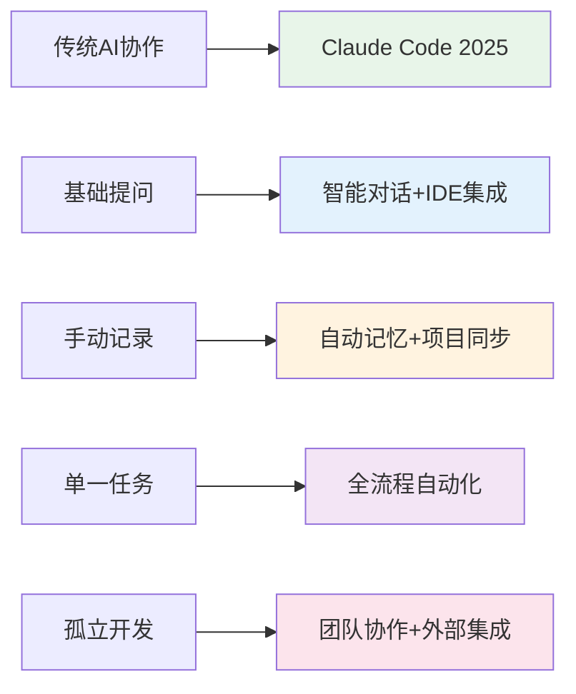

### 💎 专家级能力检查清单

#### 🔰 基础能力 (必备)
- [ ] 能够清晰表达项目需求和技术问题
- [ ] 熟练使用基础提问模板和技巧
- [ ] 掌握CLAUDE.md项目记忆管理
- [ ] 能够进行基本的代码协作和审查

#### 📈 进阶能力 (重要)  
- [ ] 能够设计复杂项目的开发流程
- [ ] 熟练使用斜杠命令和Agent功能
- [ ] 掌握长期项目的上下文管理
- [ ] 能够处理多技术栈的复杂问题

#### 🔥 高级能力 (2025核心)
- [ ] 熟练使用IDE集成进行实时协作 ⚡
- [ ] 能够配置和管理GitHub Actions自动化 🤖
- [ ] 掌握MCP协议连接外部系统 🔌
- [ ] 能够设计端到端的AI驱动工作流 🌟

#### 💎 专家能力 (顶级)
- [ ] 能够指导团队建立AI协作标准
- [ ] 具备创新AI工作流的设计能力
- [ ] 能够解决复杂的系统集成问题
- [ ] 具备AI协作培训和咨询能力

### 🏆 学习成果评估

**自测问题：**
1. 你能在5分钟内启动一个新项目的AI协作工作流吗？
2. 你能熟练使用3种以上的2025新功能吗？
3. 你能独立设计一个包含自动化测试和部署的开发流程吗？
4. 你能帮助其他开发者掌握Claude Code的使用技巧吗？

**如果以上问题你都能回答"是"，恭喜你已经成为Claude Code 2025专家！** 🎊

### 🌟 未来展望

Claude Code正在快速发展，作为AI协作专家，你需要：
- **保持好奇心** - 探索AI技术的新可能性
- **积极实践** - 在实际项目中验证和改进方法
- **分享交流** - 与社区分享经验和最佳实践
- **引领创新** - 成为AI驱动开发的先行者

现在你已经掌握了Claude Code 2025的完整协作艺术，是时候开始你的AI驱动开发之旅了！

**让我们一起用AI的力量，创造更美好的技术世界！** 🚀✨🌟

---

## 💪 实战练习

### 🎯 练习目标
通过实际练习掌握不同场景下的提问技巧，从新手快速成长为AI协作专家！

### 📚 练习1：基础项目启动（新手级 🔰）

#### 🎪 练习任务
选择以下项目之一，使用万能启动模板与AI开始对话：

**选项A：个人博客**
```
我想开发一个个人博客，主要分享技术文章。
目标用户：程序员和技术爱好者
核心功能：文章发布、分类管理、评论互动
请问我一些问题来完善这个想法！
```

**选项B：待办事项应用**
```
我想开发一个待办事项应用，帮助管理日常任务。
目标用户：需要提升效率的个人用户
核心功能：任务创建、优先级设置、进度跟踪
请问我一些问题来完善这个想法！
```

**选项C：在线记账本**
```
我想开发一个在线记账本，记录日常收支。
目标用户：想要理财的个人用户
核心功能：收支记录、分类统计、图表展示
请问我一些问题来完善这个想法！
```

#### ✅ 成功标准
- AI提出了3-5个专业问题
- 你能回答出具体的细节信息
- AI制定了可行的技术方案
- 获得了分阶段的开发计划

#### 💡 练习提示
- 如果AI问题太泛泛，说："请更具体地问我技术和功能细节"
- 如果方案太复杂，说："请给出一个简化版本，我是初学者"
- 记得保存AI生成的方案到文档中

---

### 📈 练习2：问题诊断与解决（进阶级 📈）

#### 🐛 练习任务
模拟以下常见问题，练习问题描述和解决流程：

**问题A：性能问题**
```
我的Vue应用页面加载很慢，首屏需要5秒以上。
技术栈：Vue3 + Vite + Element Plus
主要问题：打包后的文件很大，首屏白屏时间长
请帮我诊断和优化
```

**问题B：样式问题**
```
我的React组件在不同浏览器下样式表现不一致。
问题描述：Chrome正常，Safari下布局错位
使用技术：React + Styled Components
请帮我分析原因和解决方案
```

**问题C：API集成问题**
```
我在集成第三方API时遇到CORS错误。
错误信息：Access-Control-Allow-Origin header is missing
开发环境：Node.js + Express，前后端分离
请帮我解决这个跨域问题
```

#### ✅ 成功标准
- 准确描述了问题现象
- 提供了必要的技术信息
- AI给出了具体的解决步骤
- 理解了问题的根本原因

---

### 🔥 练习3：复杂项目规划（熟练级 🔥）

#### 🚀 练习任务
规划一个复杂的全栈项目，练习完整的需求分析和技术规划：

**项目：在线协作平台**
```
我想开发一个类似Notion的在线协作平台。

基本情况：
- 目标用户：小团队和个人用户
- 问题痛点：现有工具太复杂或功能单一
- 期望效果：简单易用的文档协作和项目管理

初步想法：
- 富文本编辑器
- 实时协作功能  
- 模板系统
- 权限管理

限制条件：
- 时间：6个月开发周期
- 技术：需要支持高并发和实时同步
- 资源：3人小团队

请担任产品经理，通过专业提问帮我：
1. 完善和优化需求
2. 分析技术可行性
3. 制定开发方案
4. 规划实施步骤
```

#### ✅ 成功标准
- 完成完整的需求分析对话
- 获得详细的技术架构方案
- 制定了可执行的开发计划
- 识别了关键风险和解决策略

---

### 💎 练习4：AI协作工作流（专家级 💎）

#### 🎯 练习任务
建立一个完整的AI协作工作流，包括项目管理和持续协作：

**工作流设计要求：**
1. 设计项目文档体系
2. 建立任务跟踪机制  
3. 制定代码review流程
4. 规划持续学习计划

**实施步骤：**
1. 让AI帮你设计完整的项目文档模板
2. 建立CLAUDE.md等核心文档
3. 设定定期review和优化机制
4. 制定个人技能提升计划

#### ✅ 成功标准
- 建立了完整的文档体系
- 制定了标准化的协作流程
- 能够独立管理复杂项目
- 具备了培训其他人的能力

---

### 🏆 进阶挑战

#### 挑战1：技术选型比较
选择一个项目场景，让AI比较3种不同的技术方案，并做出选择推荐。

#### 挑战2：性能优化专项
针对一个具体的性能问题，与AI进行深度技术讨论，制定完整优化策略。

#### 挑战3：开源项目贡献
让AI帮你分析一个开源项目，制定贡献计划和学习路径。

---

### 📝 练习记录模板

#### 练习反思记录
```markdown
## 练习记录 - [练习名称]

**练习时间：** [日期]
**练习等级：** [🔰/📈/🔥/💎]

### 我的提问
[记录你的原始问题]

### AI的回应
[记录AI的关键回应]

### 学到的技巧
1. [技巧1]
2. [技巧2]
3. [技巧3]

### 需要改进的地方
- [改进点1]
- [改进点2]

### 下次练习计划
[下一步要练习什么]
```

### 🎓 练习建议

#### 🔥 高效练习方法
1. **循序渐进**：从简单到复杂，逐步提升
2. **真实场景**：使用你实际需要的项目来练习
3. **记录总结**：每次练习后都要反思和记录
4. **持续实践**：定期练习，保持技能敏锐度

#### 💡 常见问题解决
- **AI回答太泛泛**：要求更具体的技术细节
- **方案太复杂**：请求简化版本或分阶段实施
- **不确定选择**：让AI比较不同方案的优缺点
- **卡住不知道问什么**：使用模板中的万能提问句式

---

---

### 🌟 练习5：2025新功能综合应用 (大师级 🌟)

#### 🚀 练习任务：构建AI驱动的全栈开发工作流

**项目场景：智能项目管理平台**
```
我要创建一个集成多种AI能力的项目管理平台，请帮我：

**阶段1：环境搭建与集成**
1. 在VS Code中设置Claude Code开发环境
2. 配置MCP连接到Jira和Figma
3. 设置GitHub Actions自动化工作流
4. 建立完整的CLAUDE.md项目记忆体系

**阶段2：AI协作开发**
1. 使用MCP从Figma获取设计稿
2. 让AI分析设计并生成组件结构
3. 在IDE中实时协作编写代码
4. 通过MCP连接数据库设计schema

**阶段3：自动化与部署**
1. 设置GitHub Actions进行代码审查
2. 配置自动化测试和性能分析
3. 实现智能依赖管理
4. 自动化文档生成和更新

**阶段4：监控与优化**
1. 集成性能监控工具
2. 设置智能告警系统
3. 实现自动化问题诊断
4. 建立持续改进机制
```

#### ✅ 成功标准
- 建立了完整的AI驱动开发工作流
- 掌握了所有2025年新功能的使用
- 能够独立设计复杂的自动化流程
- 具备指导团队使用Claude Code的能力

---

### 🏆 2025年Claude Code能力进阶路线图

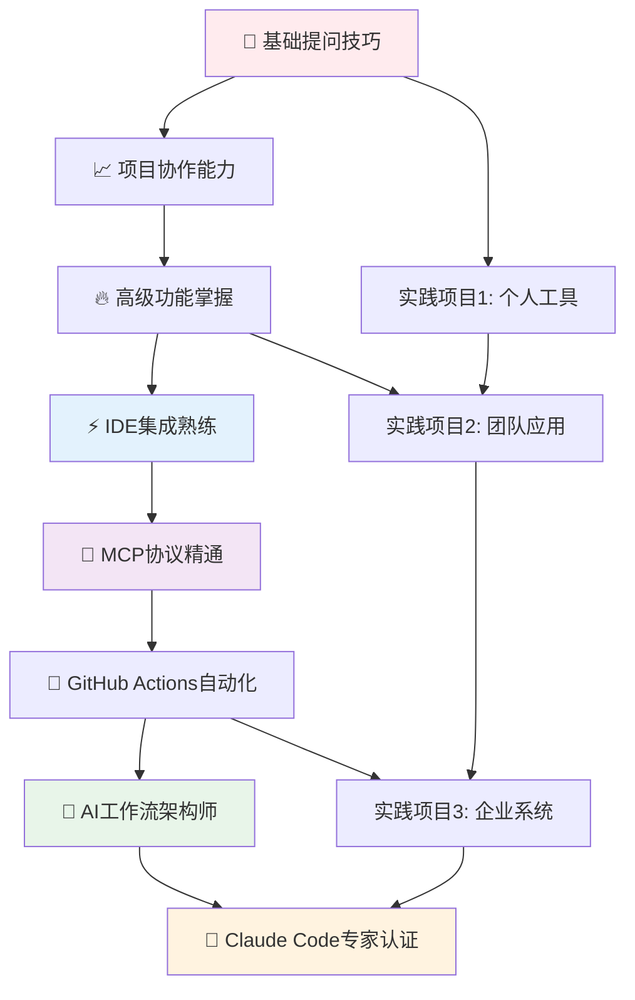

---

### 📚 持续学习资源 (2025版)

#### 🔥 官方资源更新
- **Claude Code官方文档**: 定期查看新功能更新
- **GitHub官方仓库**: 关注最新的issues和讨论
- **Anthropic博客**: 了解AI技术最新发展
- **社区论坛**: 参与开发者讨论和经验分享

#### 💡 实践项目建议

**初级项目 (1-2个月)**
1. **个人博客系统** - 练习基础AI协作
2. **待办事项管理** - 掌握数据管理和UI开发
3. **简单API服务** - 学习后端开发模式

**中级项目 (2-4个月)**
1. **在线协作工具** - 实践实时功能和用户管理
2. **电商平台** - 集成支付、搜索、推荐系统
3. **数据可视化平台** - 练习复杂数据处理

**高级项目 (3-6个月)**
1. **微服务架构系统** - 掌握分布式系统设计
2. **AI增强应用** - 集成机器学习和自然语言处理
3. **开源项目贡献** - 参与大型开源项目开发

#### 🎯 专业技能提升

**技术栈专精**
```
选择一个主要技术栈深入掌握：
- 前端: React/Vue + TypeScript + 现代工程化
- 后端: Node.js/Python/Go + 数据库 + 缓存
- 全栈: Next.js/Nuxt + 云服务 + DevOps
- 移动端: React Native/Flutter + 原生开发
```

**AI协作能力**
```
成为AI协作专家的关键技能：
1. 精准的需求表达和问题描述
2. 高效的上下文管理和项目记忆
3. 熟练的工具集成和自动化配置
4. 深度的代码审查和质量控制
5. 创新的工作流设计和优化能力
```

---

恭喜你完成了所有练习！现在你已经是真正的Claude Code 2025专家了！🏆

**记住关键要点：**
1. **保持学习** - AI技术快速发展，要跟上最新趋势
2. **多实践** - 在真实项目中应用所学技能
3. **分享经验** - 帮助其他开发者掌握AI协作技巧
4. **创新思维** - 探索AI协作的新可能性

祝你在AI驱动的开发时代中成为顶尖的技术专家！🚀🌟